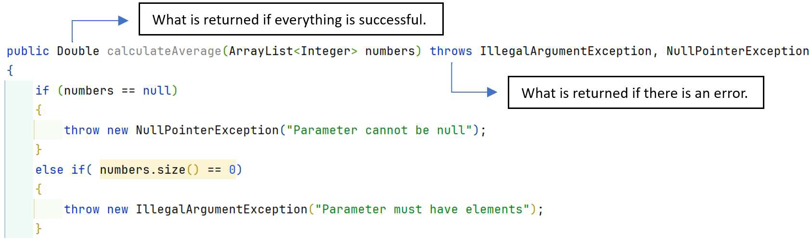

# Module 6: Exception Handling and File Processing

# Introduction

> “You don't really 'repair' or 'recover' from exceptions. You mitigate them by handling them and carrying on with the job.” 
> 
> **Justin Crites**

In the earlier [Defensive Programming chapter](https://wvup.github.io/ObjectOrientedProgramming/3-defensive-programming#exception-handling), the concept of an Exception was introduced. At that time, we politely ignored the many varied types of exceptions and said that they can all be treated as Exception objects. That was true because of Inheritance, which had not been covered yet. Java and most other languages that support exception handling leverage inheritance by creating subclasses of Exception to provide details about what went wrong. There are many subclasses of Exception in the JDK, and it is possible to create custom subtypes of Exception in your own project as well. Processing files is one of the most common places to need exception handling. The files exist outside of the source code, so they are outside of our control as developers. If a file is moved, corrupted, or inaccessible due to permissions or some other reason, exception handling is the preferred way to handle that. 

## Learning Objectives
- [Elementary exception handling review](#elementary-exception-handling-review) 
- [The Exception hierarchy](#the-exception-hierarchy) 
- [Try-Catch blocks and multi-catch blocks](#try-catch-blocks-and-multi-catch-blocks) 
- [Best practices for exception handling](#best-practices-for-exception-handling) 
- [Testing for exceptions](#testing-for-exceptions) 
- [Introduction to file processing](#introduction-to-file-processing)
- [Reading and writing data in files](#reading-and-writing-data-in-files) 
- [Serialization and Deserialization](#serialization-and-deserialization)
- [Advanced Concepts](#advanced-topics)

# Elementary Exception Handling Review

Exception handling in Java is a way to deal with runtime errors and unexpected events. Essentially it allows a block of code to return a special object called an Exception that indicates there was a problem instead of the code’s normal return value if something unexpected happens. 

Since the return type of a method is already declared in the signature, returning an Exception requires additional syntax. To return an exception when something goes wrong but still return the expected value when things go right, the throws keyword is added to the method signature. 

<figure>
  
  <figcaption class="align-center">Figure 7.1: Method signature with the throws keyword</figcaption>
</figure>

A thrown exception cannot be ignored by the code expecting the return value from where the exception was first generated. To prevent this from crashing the application, any code that might throw an exception is wrapped in the try-catch or a try-catch-finally block. If everything works as expected the code in the try block runs and the code in the catch block does not. However, if there is an exception thrown, then the remaining code in the try block is skipped and the code in the catch block immediately runs. This code will try to mitigate the error so the application can either continue running or shut down gracefully. It is very common to use logging in the catch block to record details about what caused the exception.

# The Exception Hierarchy
In the Defensive Programming chapter there was no distinction between different types of exceptions. This was done so exception handling could be introduced earlier. In truth there are many hundreds of types of exceptions, a feature that is only possible through inheritance. 

Java's exception hierarchy is structured under the *Throwable* class. From there, the hierarchy is divided into two main branches: *Exception* and *Error*. The *Error* class and its subclasses are used for serious issues the JRE may encounter when the application runs, such as a *StackOverflowError* or an *OutOfMemoryError*. These are problems that are beyond the developer’s control and the application code should not try to deal with.

## Checked and Unchecked Exceptions
The *Exception* class and its subclasses are used for issues the JRE may encounter when the application runs that the code can try to deal with. It is divided into two categories, checked exceptions and unchecked exceptions. Checked exceptions inherit from Exception and must be handled at compile time using try-catch or declared with ***throws***. Checked exceptions represent predictable and recoverable issues, such as file not found (*FileNotFoundException*), input/output errors (*IOException*), or database access issues (*SQLException*). These are but a very few examples of checked exception types. These are all used to handle scenarios where the program can recover from the error or take corrective actions. 

The other category of exceptions are unchecked exceptions, which all inherit from *RuntimeException*. These may or may not happen at runtime and are not checked by the compiler. Unchecked exceptions often indicate programming logic errors, such as accessing a null object or invalid array indexing. Examples of unchecked exceptions include *NullPointerException*, *ArrayIndexOutOfBoundsException*, and *ArithmeticException*. As with the checked exceptions, these are but a few of the subtypes available. Unchecked exceptions typically indicate bugs in the code that should ideally be fixed rather than handled programmatically. 

<pre class="mermaid">
classDiagram
	class Object
	Object<|--Throwable
	Throwable<|--Error
	Throwable<|--Exception
	Exception<|--CustomExceptions
	Exception<|--RuntimeException
	RuntimeException<|--UncheckedExceptions
    class Exception{
	    +getMessage()
		+getStackTrace()
		+printStackTrace()
		+toString()
	}
</pre>

<figure>
  <figcaption class="align-center">Figure 7.2: The Java Exception Hierarchy</figcaption>
</figure>

The Exception class declares several methods, and all subclasses inherit these. The two most used are *getMessage()* and *printStackTrace()*. The *getMessage()* method returns the string that was supplied when the object was created and includes the specific error message the developer provided when writing the code to throw the exception. This is typically what gets logged in a catch block or printed with *System.err.println()*. The *printStackTrace()* method on the other hand will print out detailed information about the method call stack that led to the issue. This is very useful for debugging but should be avoided in code that is deployed to users.

<section class="callout warning">
It is generally a bad idea to print exception details to the console because there is no guarantee the end user will be in front of a command-line console. These messages are not visible if the code in question runs in a GUI or on the web. Logging this information is a much better solution.
</section>

## Custom Exceptions
Developers can create their own exceptions by extending the *Exception* class, allowing for application-specific error handling. By inheriting from *Exception* there might be a situation where an unchecked exception found its way into the try-catch block. This can be handled in a catch block, but it is better to handle it with defensive programming practices and input validation. 

<caption><strong>Code Example: Custom exception that extends the Exception class</strong></caption>

```java
public class CustomException extends Exception 
{
  // No other code is needed 
} 
```

It is a best practice and expected that the name of the custom exception will end in the word "Exception". This can be seen with the examples mentioned earlier, such as *NullPointerException* and *ArrayIndexOutOfBoundsException*. Following this convention helps everyone know what the purpose of the class is, to act as an exception for exception handling.

# Try-Catch Blocks and Multi-Catch Blocks

These many varied subclasses of *Exception* typically do not add additional methods or fields to the superclass, although they could. This is unusual when using inheritance. Why then create subclasses if not adding more specific functionality? The answer is simple, the subtype alone is all that is needed to add functionality to the application. How is that possible though? The answer lies in the *instanceof* operator and the catch block. 

In the Defensive Programming chapter, the try-catch block was introduced like this:

<caption><strong>Code Example: Try-catch block</strong></caption>

```java
try
{
  // Code that may throw an exception
}
catch(Exception ex)
{
  // Handle the exception if it is thrown
} 
```

Recall the “is-a” relationship from inheritance. Any subclass of *Exception* “is-a” *Exception*. The catch block under the hood uses *instanceof* to test if the instance of the exception that was caught matches the given type. Since all subclasses of *Exception* meet the “is-a” relationship, this one catch block will catch all of them. 

How would it be possible then to catch different subclasses of *Exception* and handle them differently? It would be possible to use the *instanceof* operator inside the catch block and test for each subtype, like this:

<caption><strong>Code Example: Try-catch with instanceof operator</strong></caption>

```java
try
{
  // Code that may throw an exception
}
catch(Exception ex)
{
  if (ex instanceof NullPointerException)
  {
    // Handle null pointers
  }
  else if (ex instanceof ArithmeticException)
  {
    // Handle math errors
  }
}
```

This would certainly work, but it is tedious and more difficult to read than the alternative. The alternative is to use multiple catch blocks, which also uses the *instanceof* operator under the hood. Using multiple catch blocks is written like this:

<caption><strong>Code Example: Multiple catch blocks</strong></caption>

```java
try
{
  // Code that may throw an exception
}
catch(NullPointerException nex)
{
  // Handle null pointers
}
catch(ArithmeticException ae)
{
  // Handle math errors
}
catch(Exception ex)
{
  // Handle all other errors, if possible
}
```

Using multiple catch blocks is the standard approach to more refined exception handling. Subclasses provide this capability without needing to add extra fields or methods to the parent class, thanks to the *instanceof* operator.

There is one caveat though that often is overlooked by inexperienced developers. Because of the “is-a” relationship, **the order of the catch blocks matters**. The exception that was thrown is tested in the order the catch blocks are written. This means that they must be written in a specific order, from most specific subtype to least specific subtype. In the above code example, *NullPointerException* and *ArithmeticException* were caught before *Exception*. This is because thanks to the “is-a” relationship, both of those are also instances of *Exception*. If the code was instead written like this:

<caption><strong>Code Example: Incorrect catch block order - least specific to most specific</strong></caption>

```java
try
{
  // Code that may throw an exception
}
catch(Exception ex)
{
  // Handle exceptions
}
catch(NullPointerException nex)
{
  // Handle null pointers
}
catch(ArithmeticException ae)
{
  // Handle math errors
} 
```

The last two catch blocks would never execute, because the first catch block would catch all three types.

## Catching Multiple Exceptions
In certain circumstances it is possible and reasonable to catch multiple exceptions in one catch block. This should only be done if the recovery approach is identical for both exceptions.

<caption><strong>Code Example: Catching multiple exceptions</strong></caption>

```java
Double result;
try
{
  result = myClass.calculateAverage(data);
}
catch(NullPointerException | ArithmeticException ex)
{
  log.logWarning(“Caught exception when calculating an average. “ + ex.getMessage());
}
catch(Exception ex)
{
  // Handle exceptions
} 
```

In this example, both exceptions are simply going to be logged as warnings. It makes sense to handle them once in one catch block instead of writing the same code twice.

# Best Practices for Exception Handling

There are several best practices with exception handling, most of which have been touched on already. All of these will lead to cleaner code that is more robust and higher quality. 

One of the important things to never nest a try-catch inside of another try-catch. If the inner try block throws a type of exception that is not caught by that try-catch, it can propagate to the outer try-catch. This is very difficult to debug and troubleshoot. One of the simplest ways to avoid this is to only put the code that may throw an exception in the try block instead of most of the method. As an example, consider these two approaches:

<caption><strong>Code Example: Nested try-catch</strong></caption>

```java
...
try
{
  System.out.println(“Enter five numbers to average: “);
  
  for(int I = 0; I < 5; i++;)
  {
    System.out.print(“Enter a number: “);
    try
    {
      // scanner will throw an InputMismatchException if a string is entered
      data.add(scanner.nextInt());
    }
    catch(InputMismatchException ime)
    {
      // Do exceptional things
    }
    // scanner will throw an InputMismatchException if a string is entered
    data.add(scanner.nextInt());
  }
  
  // calculateAverage may throw a NullPointerException or an IllegalArgumentException
  Double avg = myClass.calculateAverage(data);
}
catch(NullPointerException npe)
{
  // Do exceptional things because data was null
}
catch(IllegalArgumentException iae)
{
  // Do exceptional things because data was likely empty
}
catch(Exception ex)
{
  // Do exceptional things
}
...
```

Versus this:

<caption><strong>Code Example: Separate try-catch</strong></caption>

```java
...
System.out.println(“Enter five numbers to average: “);

for(int I = 0; I < 5; i++;)
{
  System.out.print(“Enter a number: “);
  try
  {
    // scanner will throw an exception if a string is entered
    data.add(scanner.nextInt());
  }
  catch(InputMismatchException ime)
  {
    // Do input mismatch exceptional things
  }
  catch(Exception ex)
  {
    // Do generally exceptional things
  }
}

try
{
  myClass.calculateAverage(data);
}
catch(NullPointerException npe)
{
  // Do null pointer exceptional things
}
catch(IllegalArgumentException iae)
{
  // Do bad argument exceptional things
}
catch(Exception ex)
{
  // Do generally exceptional things
}
... 
```

At first glance, the first approach looks good. The *scanner* will throw an *InputMismatchException* if a string is entered, and that is caught by the inner try-catch. The exceptions that may be thrown by *calculateAverage* are handled in the outer try-catch. It looks like all bases are covered, right? What if the data collection was not initialized, and is null? In that case, the inner catch block wouldn’t catch it, and the outer *NullPointerException* block would catch it. Unfortunately, that block is structured to deal with a null value being passed to *calculateAverage()*, not a null type for the data collection. The root cause of this exception would be very difficult to identify. 

The second approach separates the operations into two top level try-catch blocks that only have the code that may throw the exception in the try block. This is much clearer where the exception may come from and how it is being handled. This is the approach that should always be taken. 

Always handle the exception in some fashion. If the catch block is empty, then all that has happened is the exception was suppressed and nothing was done to recover or notify anyone about the errant situation. A try-catch block should always do something in the catch block, always. 

Another best practice is to not just print the exception message or the stack trace in the catch block. Printing the stack trace is a good idea when the code is being developed but should be changed before it is deployed to users. The information in this is of no use to most end users and they likely won’t even see it if the application is a GUI or web application. Secondly, this information may be valuable to a hacker trying to break into the system. This is where logging shines, because this information will be recorded where the developer can see it later but not where it may scare an end user or provide details to a hacker. 

Sometimes this information will be printed to the screen though. If it is going to be printed, it should be done with the *System.err.print()* or *System.err.println()* instead of the regular *System.out* methods. The *System.err* methods will print in red to the STDERR stream, which more clearly indicates the error message.

Another best practice with exception handling is to fail fast. It is best to stop the program when encountering critical errors that cannot be recovered. This prevents data from being corrupted later in the application and clearly indicates to the user where in the application the error happened. 

When dealing with business rules and application specific logic, use custom exceptions. By creating meaningful custom exceptions for domain-specific errors better recovery and error handling are possible. Similarly, avoid silent failures by always logging or reporting exceptions instead of ignoring them. 

Another important best practice is to always use the try-with-resource approach when dealing with any object that will need to be closed or cleaned up regardless of an exception being thrown or not. The try-with-resource is better than the try-catch-finally block because it automatically closes and cleans up the resource, making it impossible to forget.

# Testing for Exceptions

JUnit 5 provides robust mechanisms for testing exceptions in Java code. When a method can throw an exception there are several things that unit tests can validate. These include: 
- Making sure that the exception is thrown when an error happens 
- Asserting that the message matches what is expected 
- Testing for specific exception types being thrown 
- Testing that valid operations do not throw the exception 

To test if an exception is thrown when an error happens, a unit test can leverage the *assertThrows()* method. This method takes two arguments. The first is the expected *Exception* class, and the second is a lambda expression or method reference that should throw the exception.

<caption><strong>Code Example: assertThrows() method</strong></caption>

```java
@Test
void testExceptionThrown()
{
  assertThrows(IllegalArgumentException.class, () -> {
    // Code that should throw an IllegalArgumentException
    ...
  });
}
```

Verifying the message in the exception can be tested by using the *getMessage()* method from Exception in *assertThrows()*:

<caption><strong>Code Example: getMessage() method</strong></caption>

```java
@Test
void testExceptionMessage()
{
  Exception exception = assertThrows(IllegalArgumentException.class, () -> {
    // Code that should throw an IllegalArgumentException
    ...
  });
  assertEquals("Expected error message", exception.getMessage());
} 
```

Testing for specific Exception subtypes is now possible. JUnit 5 introduced *assertThrowsExactly()* to test for a specific exception type without including its subclasses:

<caption><strong>Code Example: assertThrowsExactly() method</strong></caption>

```java
@Test
void testIllegalArgumentException()
{
  assertThrowsExactly(IllegalArgumentException.class, () -> {
    // Code that should throw specifically an IllegalArgumentException
    ...
  });
} 
```

Equally important to testing that exceptions are properly thrown when the unexpected happens is to test that no exception is thrown when everything goes the way it should. To verify that a piece of code does not throw any exception, use *assertDoesNotThrow()*:

<caption><strong>Code Example: assertDoesNotThrow() method</strong></caption>

```java
@Test
void testNoExceptionThrown()
{
  assertDoesNotThrow(() -> {
    // Code that should not throw any exception
    ...
  });
}
```

## Best Practices
Best practices to follow when testing exception handling include: 
- **Be Specific**: Test for the most specific exception type possible to ensure your error handling is precise 
- **Test Exception Details**: When relevant, assert on exception messages or other properties to verify the exact nature of the error 
- **Avoid Over-Testing**: Only test for exceptions that are part of your method's contract or represent important error conditions 
- **Use Descriptive Test Names**: Name your tests clearly to indicate what exception scenario is being tested 

By using these JUnit 5 features, you can effectively test exception handling in your Java code, ensuring that your application behaves correctly under error conditions.

# Introduction to File Processing

File processing is commonly called I/O, which is short for Input and Output. I/O operations in Java most often refers to the operations performed on files, such as reading, writing, creating, and manipulating data stored in external files. 

Java supports several file operations, including: 
- Creating Files and Directories 
- Reading Files 
- Writing Files 
- Deleting Files 
- Getting File Information 
- Serializing and Deserializing object state

## Input/Output Packages
Java provides robust file handling capabilities through various classes in the *java.io* and *java.nio* packages. These two packages have different approaches to handling I/O operations. The *java.io* package is the original and provides stream oriented I/O and offers several classes to handle file I/O operations. 

The *java.nio* package (NIO) in its current form was released in 2007 with Java version 1.7 and supports non-blocking operations, allowing a ***thread*** to request a read or write operation and then perform other tasks while waiting for the I/O to complete. This ***multi-threaded*** approach significantly improves performance when used properly. 

The NIO package is the better of the two and the one that should be used in any new development.

## File Processing Classes
The *Files* class has static methods that allow developers to work with both files and directories on the filesystem through instances of Path objects. This class enables basic operations such as create, read, write, copy, and delete for both files and directories. 

The *Paths* class is used to create instances of *Path* objects, primarily through its static *get()* method. The *Path* class is an interface and represents the location of a file on the filesystem. It provides the NIO package a way to represent a file or a directory. It is important to note, creating an instance of this class does not on its own create the file if it does not yet exist. To create a *Path* object, simply call the *Paths.get()* method with a string that represents the actual file path on the filesystem.

<caption><strong>Code Example: Path object declaration and initialization</strong></caption>

```java
Path path = Paths.get("file.txt"); // Open file.txt from the same folder 
```

In short, the *Paths* class is used to create an instance of *Path* and *Files* class uses an instance of *Path* to work on a file.

### File System Paths
The *Paths.get(String path)* path parameter can be a bit tricky. A file path is the directory or directories on the hard drive of the file in question where the file is located, along with the file name. A file path can be relative or absolute. An ***absolute path*** refers to the location of the file from the very top of the directory structure on the drive, while a ***relative path*** refers to the location of the file from the current working directory. IntelliJ always treats the project folder as its current working directory. This can seem counterintuitive because the classes are in the src subdirectory under the project directory. 

File paths are also one of the rare cases where Java may need to use operating system (OS) specific information. This is because Windows file systems are organized differently than other operating systems. In Linux, Unix, and MacOS, folders are separated by a /, and the very top directory, called the root folder, is just /. All absolute paths in these OS’s start with a /. Partitions are simply associated with empty folders under /, so the system is organized as one complete, unified directory structure. 

Windows on the other hand uses the \ character to separate directories and typically uses the concept of drive letters to separate partitions. In Windows, an absolute path will start with the drive letter, a colon, then the folder structure starting from the root folder, \ . An example of an absolute path in Windows might be `“C:\Users\student\IdeaProjects\MyProject\src\Main.java”`, whereas an absolute path in another OS might look like `“/home/student/IdeaProjects/MyProject/src/Main.java”`. 

Windows paths also run into an extra challenge by using the \ to separate directories. When dealing with strings, the \ is an escape character in Java, giving certain characters different meanings such as \n or \t. To use this in a path therefore, it is necessary to tell Java to ignore the escape character and treat it as a literal \ . This is done by escaping the meaning of \ by using another \ , which looks like this: `\\`. So, to represent the earlier path as a string in Java, it would have to be typed out as `“C:\\Users\\student\\IdeaProjects\\MyProject\src\Main.java”`. Fortunately, Java can treat / as the folder separator when on Windows, so the same path can also be written as `“C:/Users/student/IdeaProjects/MyProject/src/Main.java”`. 

A better approach is to use relative paths, which reference directories and files relative to the current working directory instead of from the root directory. By using relative directories and / as the separator, it is possible to write applications that can work with files on both Windows and all other OS’s. An example of a relative path for a file in the IntelliJ folder called info.csv would be “info.csv”, or if it was in a directory called data, the path would be “data/info.csv”. It is a best practice whenever possible to keep files and folders the application works with in the same folder as the application itself. This means that paths just need the file name or the folder that is application specific and the file name to work with files, which is much more robust because it will work on any OS. 

To overcome the differences between Windows and the other OS’s, Java also provides a standard property on the File class from the java.io package, called File.separator, which will provide the correct character depending on the OS the JRE is running on. Using it is done by building a string with this field in place of the / or `\\`. A basic example of a relative path using this property might be: “data” + File.separator + “info.csv”, which would use the information from the JRE at runtime to determine which separator to use.

# Reading and Writing Data in Files

## File Operations
To work with files on the hard drive, it is necessary to first make an instance of the Files object. Once created, Java supports several different actions on the file. These are grouped into create, copy, move, read, write, delete, and metadata operations.

### Creating a File or Directory
Creating a file or directory is done using a Path object instance as a parameter to one of the Files class’s static create methods. The most common methods are listed below: 

- **createFile(Path path, List attrs)**
	- Creates a file at the provided path with the optionally provided attributes if it does not already exist 
	- Returns: Path of the new file 
	- Throws: *FileAlreadyExistsException*
- **createDirectory(Path dir, List attrs)**
	- Creates a directory at the provided path with the optionally provided attributes if it does not already exist 
	- Returns: Path of the new directory 
	- Throws: 
		- *FileAlreadyExistsException* if a file or folder already exists 
		- *IOException* if the parent directory does not exist
- **createDirectories(Path dir, List attrs)**
	- Creates a directory by creating all nonexistent parent directories first An exception is not thrown if the directory could not be created because it already exists 
	- Returns: Path of the new directory 
	- Throws: *FileAlreadyExistsException* 

<caption><strong>Code Example: createFile() method</strong></caption>

```java
Path path = Paths.get("file.txt");
Path createdFilePath;

try
{
  createdFilePath = Files.createFile(path);
  System.out.println("File Created at Path : " + createdFilePath);
}
catch (IOException e)
{
  e.printStackTrace();
}
```

Using the *createDirectory()* and *createDirectories()* works the same way, but with the string parameter to the *Paths.get()* method referencing a directory instead of a file.

### Deleting a File or Directory
Another common operation with files and folders is to delete them when they are no longer needed. This is most often done with temporary files but may also be done as part of a log rotation strategy or other general maintenance. The most common methods are listed below:

- **Files.delete(Path path)**
	- Deletes the file from specified path If it is a directory, it must be empty first 
	- Returns: void 
	- Throws:
		- *NoSuchFileException*
		- *DirectoryNotEmptyException*
- **Files.deleteIfExists(Path path)**
	- Deletes the file from specified path if it exists If it is a directory, it must be empty first 
	- Returns: A boolean indicating success or failure 
	- Throws:
		- *NoSuchFileException*
		- *DirectoryNotEmptyException*

<caption><strong>Code Example: Files.delete() method</strong></caption>

```java
Path path = Paths.get("/path/to/file.txt");

try
{
  Files.delete(path);
  System.out.println("File deleted successfully");
}
catch (NoSuchFileException | DirectoryNotEmptyException ex)
{
  System.err.println("Error deleting file: " + ex.getMessage());
}
```

<caption><strong>Code Example: Files.deleteIfExists() method</strong></caption>

```java
Path path = Paths.get("/path/to/directory");
boolean deleted = Files.deleteIfExists(path);

if (deleted)
{
  System.out.println("File deleted successfully");
}
else
{
  System.out.println("File did not exist");
} 
```

Deleting a directory can be done with both above examples, provided the string passed to the Path object references a directory instead of a file and the directory is empty. However, it is sometimes useful to be able to delete a directory that is not empty. Doing this requires first deleting everything inside the directory, then deleting the directory itself. This is known as a ***recursive delete***. To do this it is necessary to first find everything inside the directory. The *Files.walk()* method does this. Once the contents of the directory are found, then simply loop over each one deleting them individually. 

In this example, the results of the *Files.walk()* method are sorted in reverse order to get the lowest level so child files and directories are deleted before the parent directories.

<caption><strong>Code Example: Files.walk() method</strong></caption>

```java
public class DeleteDirectory
{
  public static void deleteDirectoryRecursively(Path path) throws IOException
  {
    Stream<Path> pathStream;
    
    try
    {
      pathStream = Files.walk(path);
    }
    catch (Exception ex)
    {
      // Log the exception
    }
    
    if (pathStream != null)
    {
      pathStream.sorted(Comparator.reverseOrder()).forEach(p -> {
        try
        {
          Files.delete(p);
        }
        catch (IOException ex)
        {
        // Log an error deleting this file
        }
      });
    
    pathStream.close();
    }
  }

  // Example of calling the deleteDirectoriesRecursively method
  public static void main(String[] args)
  {
    Path directoryPath = Paths.get("/path/to/directory");
    
    try
    {
      // From another class, use DeleteDirectory.deleteDirectoriesRecursively(directoryPath);
      deleteDirectoryRecursively(directoryPath);
      System.out.println("Directory deleted successfully");
    }
    catch (IOException e)
    {
      System.err.println("Error deleting directory: " + e.getMessage());
    }
  }
} 
```

### Copying and Moving Files and Directories
Copying and moving is another common operation with files and folders. This may be done for data backup or restoration, as part of a log rotation strategy, or as part of other general maintenance. The most common methods are listed below:

- **copy(InputStream in, Path target, CopyOptions options)**
	- Copies all bytes from an input stream to a file. On return, the input stream will be at the end of a stream. 
	- Returns: Number of bytes read or written 
	- Throws: 
		- *IOException* 
		- *FileAlreadyExistsException* 
		- *DirectoryNotEmptyException* 
		- *UnsupportedOperationException* 
		- *SecurityException*
- **copy(Path source, OutputStream out)**
	- Copies all bytes from a file to an output stream. 
	- Returns: Number of bytes read or written 
	- Throws: 
		- *IOException* 
		- *SecurityException*
- **copy(Path source, Path target, CopyOptions options)**
	- Copy a file to a target file 
	- Returns: Path of the target file 
	- Throws: 
		- *UnsupportedOperationException* 
		- *FileAlreadyExistsException* 
		- *DirectoryNotEmptyException* 
		- *IOException* 
		- *SecurityException*
- **move(Path source, Path target, CopyOption… options)**
	- Move or rename a file to a target file 
	- Returns: Path of the target file 
	- Throws: 
		- *UnsupportedOperationException* 
		- *FileAlreadyExistsException* 
		- *DirectoryNotEmptyException* 
		- *AtomicMoveNotSupportedException* 
		- *IOException* 
		- *SecurityException*

In this example, the *copy()* overload method that takes two *Path* objects is used to copy a file (“file.txt”) from one directory to another.

<caption><strong>Code Example: copy() method</strong></caption>

```java
Path source = Paths.get("/path/to/source/file.txt");
Path target = Paths.get("/path/to/target/file.txt");

try
{
  Files.copy(source, target, StandardCopyOption.REPLACE_EXISTING);
  System.out.println("File copied successfully");
}
catch (IOException ex)
{
  System.err.println("Error copying file: " + ex.getMessage());
} 
```

In this example: the *move()* method is used to move a file from one directory to another with the same filename. To rename the file, simply use the same folders in the *Path* parameter with a different filename. To move a directory, just provide a path parameter to the *get()* method that references a directory instead of a file:

<caption><strong>Code Example: move() method</strong></caption>

```java
Path source = Paths.get("/path/to/source/file.txt");
Path target = Paths.get("/path/to/target/file.txt");

try
{
  Files.move(source, target, StandardCopyOption.REPLACE_EXISTING);
  System.out.println("File moved successfully");
}
catch (IOException ex)
{
  System.err.println("Error moving file: " + ex.getMessage());
} 
```

Copying a non-empty directory requires recursively copying its contents, much like deleting a nonempty directory. Here's a method to copy a directory and its contents:

<caption><strong>Code Example: copy() method - directory and contents</strong></caption>

```java
public static void copyDirectory(Path source, Path target) throws IOException
{
  Files.walkFileTree(source, new SimpleFileVisitor<Path>()
  {
    @Override
    public FileVisitResult preVisitDirectory(Path dir, BasicFileAttributes attrs) throws IOException
    {
      Path targetDir = target.resolve(source.relativize(dir));
      Files.createDirectories(targetDir);
      return FileVisitResult.CONTINUE;
    }
    
    @Override
    public FileVisitResult visitFile(Path file, BasicFileAttributes attrs) throws IOException
    {
      Files.copy(file, target.resolve(source.relativize(file)), standardCopyOption.REPLACE_EXISTING);
      return FileVisitResult.CONTINUE;
    }
  });
} 
```

Here is an example of using the above method to copy a non-empty source directory:

<caption><strong>Code Example: copy() method</strong></caption>

```java
Path sourceDir = Paths.get("/path/to/source/directory");
Path targetDir = Paths.get("/path/to/target/directory");

try
{
  copyDirectory(sourceDir, targetDir);
  System.out.println("Directory copied successfully");
}
catch (IOException ex)
{
  System.err.println("Error copying directory: " + ex.getMessage());
} 
```


### Getting Metadata About a File or Directory
***Metadata*** is a term that means data about data. In the context of files and directories, this typically refers to one or more of the following: 
- **Name**: The name of the file or directory 
- **Attributes**: The attributes and their values of the file or directory 
- **Owner**: The user who owns the file or directory 
- **Permissions**: The user permissions of the file or directory 
- **Type**: The file type 
- **Size**: The size of the file 

The file name of a file can be found using the *getFileName()* method of the *Path* class:

<caption><strong>Code Example: getFileName() method</strong></caption>

```java
Path path = Paths.get("/path/to/your/file.txt");
Path fileName = path.getFileName();
System.out.println("File name: " + fileName); 
```

File attributes are characteristics about a file or folder that apply equally to everyone. They are different from permissions, which apply to specific users and groups. To get the attributes of a file or folder, use the *Files.readAttributes()* method:

<caption><strong>Code Example: Files.readAttributes() method</strong></caption>

```java
Path path = Paths.get("/path/to/file");

try
{
  BasicFileAttributes attr = Files.readAttributes(path, BasicFileAttributes.class);
  
  System.out.println("Creation time: " + attr.creationTime());
  System.out.println("Last access time: " + attr.lastAccessTime());
  System.out.println("Last modified time: " + attr.lastModifiedTime());
  System.out.println("File size: " + attr.size());
  System.out.println("Is directory: " + attr.isDirectory());
  System.out.println("Is regular file: " + attr.isRegularFile());
  System.out.println("Is symbolic link: " + attr.isSymbolicLink());
}
catch (IOException ex)
{
  System.err.println("Error reading file attributes: " + ex.getMessage());
} 
```

For specific attributes, you can use the Files.getAttribute() method:

<caption><strong>Code Example: getFileName() method</strong></caption>

```java
FileTime creationTime = (FileTime) Files.getAttribute(path, "creationTime");
System.out.println("Creation time: " + creationTime);
```

The owner of a file or directory can be discovered using the *Files.getOwner()* method or the *FileOwnerAttributeView* class:

<caption><strong>Code Example: Files.getOwner() method</strong></caption>

```java
Path path = Paths.get("/path/to/file_or_directory");

try
{
  // Get the owner of the file or directory
  UserPrincipal owner = Files.getOwner(path);
  System.out.println("Owner: " + owner.getName());
}
catch (IOException ex)
{
  System.err.println("Error retrieving owner: " + ex.getMessage());
} 
```

For more advanced use cases, you can use the *FileOwnerAttributeView* class to get or set the owner of a file:

<caption><strong>Code Example: FileOwnerAttributeView</strong></caption>

```java
Path path = Paths.get("/path/to/file_or_directory");

try
{
  // Get the FileOwnerAttributeView
  FileOwnerAttributeView view = Files.getFileAttributeView(path, FileOwnerAttributeView.class);
  
  // Retrieve the owner
  UserPrincipal owner = view.getOwner();
  System.out.println("Owner: " + owner.getName());
}
catch (IOException ex)
{
  System.err.println("Error retrieving owner: " + ex.getMessage());
} 
```

To find the POSIX permissions of a file or directory, the *Files* class provides three different methods:

<caption><strong>Code Example: POSIX permissions</strong></caption>

```java
boolean isReadable = Files.isReadable(path);
boolean isWritable = Files.isWritable(path);
boolean isExecutable = Files.isExecutable(path);

System.out.println("Is readable: " + isReadable);
System.out.println("Is writable: " + isWritable);
System.out.println("Is executable: " + isExecutable); 
```

To find the type of file, the *Files* class provides two methods, *Files.isDirectory(Path)* and *Files.isRegularFile()*. Both methods return false if the path does not exist or if there's an I/O error.

<caption><strong>Code Example: Files.isDirectory() and Files.isRegularFile()</strong></caption>

```java
Path path = Paths.get("/path/to/check");

boolean isDirectory = Files.isDirectory(path);
boolean isFile = Files.isRegularFile(path);

System.out.println("Is directory: " + isDirectory);
System.out.println("Is file: " + isFile); 
```

There are also methods beyond *Files.isRegularFile()*, which are used in the same way. These include: 
- Files.isExecutable() 
- Files.isReadable() 
- Files.isWritable() 
- Files.isHidden() 
- Files.isSamefile() 
- Files.isSymbolicLink() 

To get the size of a file, the *Files.size()* method can be used. It returns the size of the file in bytes.

<caption><strong>Code Example: Files.size()</strong></caption>

```java
Path path = Paths.get("/path/to/your/file");
try
{
  long bytes = Files.size(path);
  System.out.println("File size: " + bytes + " bytes");
  System.out.println("File size: " + (bytes / 1024) + " kilobytes");
}
catch (IOException ex)
{
  System.err.println("Error getting file size: " + ex.getMessage());
} 
```

## File Processing
Working with the content of a file involves reading the content of a file or directory or writing content to a file or directory. The NIO library provides several ways to process the contents of files and directories.

### Reading Files
To read the entire contents of a file into a byte array, the *Files.readAllBytes()* method is used:

<caption><strong>Code Example: Files.readAllBytes()</strong></caption>

```java
Path path = Paths.get("file.txt");
String content;
try
{
  byte[] bytes = Files.readAllBytes(path);
  content = new String(bytes);
}
catch (IOException ex)
{
  log.logWarning(ex.getMessage());
}
```

More often though it is useful to read the lines of a file, which can be done with *Files.readAllLines()*:

<caption><strong>Code Example: Files.readAllLines()</strong></caption>

```java
Path path = Paths.get("file.txt");
try
{
  List<String> lines = Files.readAllLines(path);
}
catch(IOException ex)
{
  log.logWarning(ex.getMessage());
} 
```

Both approaches work well with small to medium files. For larger files it can be useful to read the contents of the file as a stream. This is done with the *Files.lines()* method:

<caption><strong>Code Example: Files.lines()</strong></caption>

```java
Path path = Paths.get("file.txt");
try (Stream<String> stream = Files.lines(path))
{
  stream.forEach(System.out::println);
}
catch(IOException ex)
{
  log.logWarning(ex.getMessage());
}
```

Another efficient approach for large files of characters involves using a *BufferedReader* object. This can be used with the *Files.newBufferedReader()* method:

<caption><strong>Code Example: Files.newBufferedReader()</strong></caption>

```java
Path path = Paths.get("file.txt");
try (BufferedReader reader = Files.newBufferedReader(path))
{
  String line;
  
  while ((line = reader.readLine()) != null)
  {
    System.out.println(line);
  }
}
catch(IOException ex)
{
  Log.logWarning(ex.getMessage());
} 
```

With any of the approaches that read line by line, processing data is often done by breaking up the line into different columns. This is typical of CSV files or Tab delimited files, among other formats. The approach is not as reliable as a relational database because the file can be easily edited, have its format changed, deleted, or moved outside of the application, but this approach is simpler in some ways. 

The basic algorithm is the same for any structured file. For each line, split it into the columns, then process each column one at a time. This typically uses the String object’s *split()* method to break the line up into an array of columns, and then reads each element of the array. With this approach, each column typically corresponds to one field of an object. Each field of the array is then converted to the appropriate data type from the string, and then assigned to an instance of the object. 

Take a file of Student records with an Id, first and last name, and a GPA field called students.csv that is using the CSV format:

<caption><strong>File Example: students.csv</strong></caption>

```
1,Karen,Garcia,3.16
2,David,Williams,0.79
3,Barbara,Garcia,2.54
4,Joseph,Wilson,3.64
5,James,Smith,3.93
```

To process this file into instances of *Student* objects, the code would do the following:

<caption><strong>Code Example: CSV file processing</strong></caption>

```java
Path path = Paths.get("students.csv");

try (BufferedReader reader = Files.newBufferedReader(path))
{
  String line;
  
  while ((line = reader.readLine ()) != null)
  {
    String[] fields = line.split(",");
    int id = Integer.parseInt (fields[0]);
    String firstName = fields[1];
    String lastName = fields[2];
    double gpa = Double.parseDouble (fields[3]);
    students.add(new Student(id, firstName, lastName, gpa));
  }
}
catch(IOException ex)
{
  log.logWarning(ex.getMessage());
}
```


### Reading Files with Scanner
In addition to these approaches, it is also possible to process files using the *Scanner* object. Normally the scanner works with the *System.in* input stream, but it can also work with *File* objects.

<caption><strong>Code Example: Reading files with Scanner</strong></caption>

```java
try
{
  Scanner scanner = new Scanner(new File("sample.txt"));
  
  while (scanner.hasNextLine())
  {
    System.out.println(scanner.nextLine());
  }
}
catch (FileNotFoundException ex)
{
  log.logWarning(ex.getMessage());
}
finally
{
  scanner.close();
} 
```

### Writing Files
While reading the contents of files is important, the content of the files must first be added. To do this it is necessary to write information into a file. The simplest way to write data to a file is using the *Files.write()* method:

<caption><strong>Code Example: Files.write()</strong></caption>

```java
Path filePath = Paths.get("example.txt");
byte[] bytes = "Hello, world!".getBytes();
Files.write(filePath, bytes); 
```

This method offers several advantages. It will create the file if it doesn't exist, and it automatically closes the file after writing. Be aware though that, good or bad, it overwrites the file content by default. Fortunately, it is possible to customize the write operation using *StandardOpenOption*:

<caption><strong>Code Example: StandardOpenOption</strong></caption>

```java
Files.write(filePath, bytes, StandardOpenOption.APPEND);
```

With this option, the data in bytes will be appended to the end of the file instead of overwriting it. 

There is also an overloaded version of *Files.write()* that uses a List parameter instead of a byte array. This method writes each string as a separate line in the file and is easy to use:

<caption><strong>Code Example: Files.write()</strong></caption>

```java
List<String> lines = Arrays.asList("Line 1", "Line 2", "Line 3");
Files.write(filePath, lines);
```

With these methods it is possible to read a file as a list of strings, edit one or more lines, and then write that data back to the same file as a means of updating the file. While not efficient for very large files, this works well in most circumstances.

# Serialization and Deserialization

Recall that the state of an object instance is all the fields of that object instance and their corresponding values. In an earlier example, an approach of persisting state was shown reading data from a CSV file. Using the techniques shown for writing lines to files, it is not difficult to imagine being able to persist the state of an application by writing the state of each object to a CSV or Tab-delimited file. The next time the application runs, it reads these states back from the file, recreating the object instances and restoring them to their previous states. In this way, an application persists its state over being stopped and restarted. 

The term ***serialization*** refers to the process of converting an object’s state into a format that can be easily stored or transmitted. This typically involves transforming an object instance into a ***markup language*** format as a string. The serialized format preserves the state of an object, including the values of its properties. No method information needs to be stored because methods only define actions that the object can take. 

***Deserialization*** is the reverse process of serialization. It involves reconstructing an object instance from the serialized data. This process allows the recreation of objects after they have been serialized for transmission or storage. The use of serialization and deserialization of application information has several advantages. 

Using a standard format such as ***JSON*** or ***XML***, it is possible to exchange application information between different applications. Almost every programming language has at least one library that can understand these formats of data. This is in fact the foundation of web services and web APIs. Being able to store and re-create the state of objects in an application when the application is stopped and restarted is another important capability that serialization and deserialization provide. This type of persistence is important to most information systems. 

The two most common formats of this are JSON and XML. JSON stands for JavaScript Object Notation, and XML stands for Extensible Markup Language. These are two different string formats that both solve the same problem, representing the state of a data structure. Both are human-readable formats that are easy for both humans and machines to work with. Both provide a straightforward mechanism for serialization, allowing the conversion of complex data structures into a format that can be easily stored or transmitted, and then reconstructed back into their original form through deserialization. 

JSON serialization is more lightweight than XML, meaning file formats are simpler and the same serialized data is generally smaller than the equivalent XML. It has become the most popular choice for ***RESTful web services*** in recent years because of this. XML has a stricter format and can enforce schema rules, providing more control of the data being serialized, which has its own advantages. In general, both solve the same problem: Serializing object state to a string that can be stored or transmitted over a network and deserialized later to re-create the object instance. 

Earlier an example of this using a CSV file was shown. Using a structured markup language such as JSON or XML offers several advantages over this approach. Both JSON and XML support hierarchical and nested structures, allowing for more complex data representation than a CSV file can support. This aligns better with object-oriented programming structures, making it easier to map data to code objects. The order of elements in these documents is also largely irrelevant, which is a significant advantage over CSV and similar flat file formats. 

JSON and XML also support a wider range of data types, including booleans, arrays, numbers, and objects while CSV is limited to strings which the developer must then parse and convert. While CSV and similar formats excel in simplicity and small file size for flat data, JSON and XML offer better flexibility, stronger data typing, and more complex structure, making them more suitable for complex data.


## Adding JSON Support
In Java, there is no library native to the JDK to handle JSON or XML. There are two good libraries available though, Jackson and GSON. Of the two, Jackson is more widely used and more powerful. Jackson can also work with both JSON and XML, while GSON can only work with JSON documents. Jackson can be added to a project in IntelliJ the same way JUnit is added. Jackson provides three core modules: 
- Streaming (jackson-core) defines a low-level streaming API and includes JSON-specific implementations 
- Annotations (jackson-annotations) contains standard Jackson annotations 
- Databind (jackson-databind) implements data binding and object serialization

Adding the latest version of the Jackson databind module (`com.fasterxml.jackson.core:jackson-databind`) to a project also adds the streaming and annotation modules as transitive dependencies. Once added, reload the Maven project to ensure all changes are applied by right-clicking on the project in the Project view, then selecting Maven > Reload project.

## Class Requirements for Jackson
To use Jackson effectively for JSON serialization and deserialization in Java, your classes need to meet certain requirements. These include: 
- Default Constructor: Jackson requires a no-argument constructor (default constructor) for deserialization. This allows it to create an instance of the class before populating its fields. 
- Getters and Setters: For serialization, Jackson uses the public getter methods to extract field values and convert them into JSON. For deserialization, it uses public setter methods or direct field access (if configured)

### Jackson's ObjectMapper
The *ObjectMapper* class is central to Jackson's JSON functionality. An instance of this class is what does most of the serialization and deserialization work. Assume you have the following class:

<caption><strong>Code Example: Person sample class</strong></caption>

```java
public class Person
{
  private String firstName;
  private String lastName;
  private int age;
  
  public Person()
  {
  }
  
  // Constructor
  public Person(String firstName, String lastName, int age)
  {
    this.firstName = firstName;
    this.lastName = lastName;
    this.age = age;
  }
  
  public String getFirstName()
  {
    return firstName;
  }
 
  public void setFirstName(String firstName)
  {
    this.firstName = firstName;
  }
  
  public String getLastName()
  {
    return lastName;
  }
  
  public void setLastName(String lastName)
  {
    this.lastName = lastName;
  }
  
  public int getAge()
  {
    return age;
  }
  
  public void setAge(int age)
  {
    this.age = age;
  }
}
```

This class meets the Jackson requirements, because it has a default constructor and getters/setters for the class properties. Jackson can serialize and deserialize an instance of this class to and from JSON using the *ObjectMapper*.

<caption><strong>Code Example: ObjectMapper</strong></caption>

```java
ObjectMapper mapper = new ObjectMapper();

// Serialize Java object to JSON
Person person = new Person("John", "Doe", 30);
String json = mapper.writeValueAsString(person);
System.out.println(json);

// Deserialize JSON to Java object
String jsonString = ”””
{
  \"firstName\": \"Jane\",
  \"lastName\": \"Doe\",
  \"age\":25
}”””;

Person deserializedPerson = mapper.readValue(jsonString, Person.class);

System.out.println(deserializedPerson.getFirstName());
```

This demonstrates the basic usage of Jackson to serialize and deserialize an object to and from JSON. Here the JSON was hard coded into a string variable, but most often this is read from a file or a web service. 

The equivalent object for XML serialization and deserialization is Jackson’s *XmlMapper*.

## JSON Formatting
Jackson provides two main approaches for JSON serialization: compact printing and pretty printing.

### Compact Printing
By default, Jackson uses ***compact printing***, which minimizes whitespace for efficient data transfer and storage.

<caption><strong>Code Example: Compact printing</strong></caption>

```java
ObjectMapper mapper = new ObjectMapper(); 
Person person = new Person("John Doe", 30); 
String json = mapper.writeValueAsString(person);
```

<caption><strong>File Output: Compact printing</strong></caption>

```
{"name":"John Doe","age":30}
```


### Pretty Printing
***Pretty printing*** formats JSON with indentation and line breaks, making it more readable for humans. 

<caption><strong>Code Example: Pretty printing</strong></caption>

```java
Using writerWithDefaultPrettyPrinter(): 
ObjectMapper mapper = new ObjectMapper(); 
Person person = new Person("John Doe", 30); 
String json = mapper.writerWithDefaultPrettyPrinter().writeValueAsString(person);
```

<caption><strong>File Output: Pretty printing</strong></caption>

```java
{ 
  "name" : "John Doe", 
  "age" : 30 
}
```

This can also be enabled on the *Mapper* object itself, so it applies to all uses:

<caption><strong>Code Example: Serialization enabled on ObjectMapper instance</strong></caption>

```java
ObjectMapper mapper = new ObjectMapper();
mapper.enable(SerializationFeature.INDENT_OUTPUT);
String json = mapper.writeValueAsString(person);
```

**Use Cases** 
- Pretty Printing: Debugging, logging, or human-readable output 
- Compact Printing: API responses, data storage, or network transmission where minimizing size is important

<section class="callout info">
Pretty printing is useful during development, while compact printing is generally preferred for production environments to optimize performance and reduce data transfer sizes.
</section>

The equivalent of pretty printing with XML is achieved by configuring the *XmlMapper* object to support indentation:  

<caption><strong>Code Example: XML pretty printing</strong></caption>

```java
xmlMapper.enable(SerializationFeature.INDENT_OUTPUT);
```

This object also has the *readValue()* and *writeValueAsString()* methods.

## Enabling JSON Capability
A simple way to enable JSON serialization and deserialization in an application is to add a utility class with a few static methods. Start by creating a *JsonUtility* class in a project. 

To serialize an object, add a static method named *toJSON()*, like this:

<caption><strong>Code Example: Serialization - toJSON()</strong></caption>

```java
public static String toJSON(Object o, boolean prettyPrint)
{
  ObjectMapper mapper = new ObjectMapper();
  if(prettyPrint)
  {
    return mapper.writerWithDefaultPrettyPrinter().writeValueAsString(o);
  }
  
  return mapper.writeValueAsString(o);
} 
```

This method uses the *prettyPrint* boolean to decide whether to use the writer with pretty printing or not. Regardless, the *writeValueAsString()* method is then called with the method’s Object parameter, *o*. For this to work, the object instance passed to the method would need to meet the minimum requirements for serialization, which is having public getter methods. This method can serialize any object instance to JSON that meets this criterion. 

Deserializing is a little more complicated, because the starting point is a string, not an object. To overcome this, the use of generics and the *Class* class can be used. A generic is a way to define a class that can work with any other class type, to be defined by the developer. The *ArrayList* class is a good example of a class that uses generics, where the class type the *ArrayList* will hold is defined in the <> brackets. Java uses a placeholder for the type with generics, typically the letter *T*. 

This static method will create and return an object instance of the class type passed in as the *cls* parameter:

<caption><strong>Code Example: Deserialization - fromJSON()</strong></caption>

```java
public static <T> T fromJSON(String json, Class<T> cls) throws RuntimeException
{
  ObjectMapper mapper = new ObjectMapper();
  
  try
  {
    return mapper.readValue(json, cls);
  }
  catch(Exception ex)
  {
    throw new RuntimeException(“Failed to deserialize JSON”, ex);
  }
} 
```

This short method has a lot going on. Start with the method signature: 
- \<T> : Declares a generic class type parameter that the method will return 
- *T*: The return type dynamically determined by the Class parameter 
- *Class cls*: Specifies the runtime class type of the object to be deserialized 

To use this method: 
- Pass the JSON string and the target class type (Person.class, Car.class) to the static method. 
- The method dynamically deserializes the string and returns an instance of the specified type

<caption><strong>Code Example: Person deserialization</strong></caption>

```java
// Deserialize into Person class 
Person person = JsonUtil.deserialize(personJson, Person.class);
```

This method uses the *readValue()* method of the *ObjectMapper* class to read the string parameter *json* and convert it into a class of the *cls* parameter type. The word *class* is a reserved word, so the parameter has been abbreviated here to *cls*. Assuming the class type *cls* meets the Jackson requirements of having a default constructor and setter methods, this method should be able to deserialize any object from the JSON string into an object instance.

# Advanced Topics

## File Encoding
Character encoding is the process of representing characters, such as letters, numbers, and symbols, as specific sequences of bits that computers can understand and process. Examples of encoding include ASCII and UTF-8. Encoding schemes provide a mapping between human-readable characters and their digital representations, allowing computers to store, transmit, and display text accurately. 

When saving text to a file, the characters are converted into bytes according to the chosen encoding scheme. This ensures that the file contains the correct binary representation of the text under the hood. When opening a file, the computer uses the specified encoding to interpret the bytes and convert them back into readable characters. Using the wrong encoding can result in garbled text or incorrect display of special characters. 

Proper character encoding ensures that files maintain their integrity across different systems and applications. This is especially important when dealing with multilingual content or special characters. It is possible to specify the encoding when writing or reading files to handle different encodings in Java. 

Using the right encoding is crucial for ensuring compatibility between different systems and applications. Unicode encodings like UTF-8 are widely supported and can represent characters from virtually all writing systems. In Windows legacy applications, the Windows-1252 (also known as CP-1252) is still used as the default encoding scheme. Windows primarily uses UTF-16LE as its default Unicode character encoding for internal text processing and storage, and Windows Notepad uses UTF-8 encoding when creating new text files in recent versions of Windows 10 and 11.

## Random Access Files
Random file access using Java’s NIO package allows reading from and writing to specific positions in a file without sequentially traversing the entire file. This is done with the use of channels and buffers, which provide efficient and flexible file operations. The key components that enable this functionality are: 
- *FileChannel*: This class represents an open connection to a file and allows for random access operations 
- *SeekableByteChannel*: An interface implemented by FileChannel that defines methods for positioning within a file 
- *ByteBuffer*: A container for bytes that can be read from or written to channels

## Jackson Annotations
Jackson ***annotations*** are part of the Jackson library. These annotations allow developers to customize how Java objects are serialized into JSON and how JSON is deserialized into Java objects. They provide fine-grained control over the mapping between Java objects and JSON structures. 

By using Jackson annotations effectively, developers can ensure clean and maintainable mappings between Java classes and their corresponding JSON representations, even when the class in question does not fit the standard rules such as having a default constructor, getters, and setters for all fields. Examples of common annotations include: 
- *@JsonCreator*: Marks constructors or factory methods for object creation during deserialization, useful for immutable objects or those without a default constructor 

<caption><strong>Code Example: @JsonCreator annotation</strong></caption>

```java
@JsonCreator 
public Person(@JsonProperty("id") long id, @JsonProperty("name") String name) 
{ 
	... 
} 
```

- *@JsonIgnore*: Prevents a field from being serialized or deserialized. Useful for calculated or secret fields 

<caption><strong>Code Example: @JsonIgnore annotation</strong></caption>

```java
@JsonIgnore private 
String sensitiveData; 
```

- *@JsonProperty*: Specifies the property name in JSON during serialization/deserialization. Useful for renaming fields 

<caption><strong>Code Example: @JsonProperty annotation</strong></caption>

```java
@JsonProperty("name") 
private String holderName; 
```

These are just a few examples of the available JSON annotations. There are also XML specific annotations.

## Database Access
Serialization and deserialization provide a powerful way to add persistence in an application. Like CSV and similar files though, it stores data in plain text files that can be easily manipulated or moved outside of the application. A more common and much more powerful approach to data persistence is to use a relational database. Relational databases enforce data types and data schema, and the database server, often called a Relational Database Management System (RDBMS) will provide a mechanism for authentication and authorization, only allowing the manipulation of the data or its structure by authorized users. Relational databases also perform much faster than serialization and deserialization of plain text files on a hard drive. 

Java provides the ability to work with relational databases through the JDBC (Java Database Connectivity) package. JDBC provides a standardized way for Java programs to connect to and manipulate data stored in various database management systems. Due to differences in implementation, each RDBMS will have its own implementation of the JDBC interface. This means applications written using JDBC have one interface for database operations that will work with a wide variety of DBMS’s, which allows developers to write database-agnostic code. 

JDBC enables Java applications to perform essential database operations such as: 
- Establishing connections to data sources 
- Executing SQL queries 
- Processing result sets 
- Managing transactions 

JDBC plays a crucial role in Java application development by providing a clean and consistent way to interact with databases, ensuring data persistence and retrieval across various data sources. 

In addition to the JDBC driver, Java also has a standard high-level API for database interactions, called the ***Java Persistence API*** (JPA). The ***JPA*** is a specification that provides a standardized approach for ***object-relational mapping*** (ORM) in Java applications. An ***ORM*** library is a layer of abstraction that allows developers to interact with databases using object-oriented code instead of writing ***SQL queries*** directly. By using ORM libraries like ***Hibernate***, developers can work with familiar object-oriented concepts rather than dealing directly with database structures while also solving business problems.

# Summary

This chapter provided a comprehensive overview of exception handling and file processing in Java. It covered the exception hierarchy, the importance of using try-catch blocks, best practices, and the distinction between checked and unchecked exceptions. It also introduced file I/O using the java.nio package, including reading, writing, creating, deleting, and copying files and directories. Advanced topics such as serialization, deserialization, character encoding, random access files, and JSON/XML support were discussed. Through examples and best practices, students are equipped with the tools to build robust and error-resilient applications that interact with the file system and handle unexpected runtime events effectively.

# Review Questions

1. What is the difference between checked and unchecked exceptions in Java? 
2. How does the exception hierarchy in Java benefit exception handling? 
3. What are the best practices for using try-catch blocks effectively? 
4. Why should you avoid nested try-catch blocks? 
5. Describe how to test for exceptions using JUnit 5. 
6. What is the difference between java.io and java.nio packages? 
7. How do relative and absolute paths differ in Java file handling? 
8. What is the purpose of the Files and Paths classes in the java.nio package? 
9. How can you serialize and deserialize Java objects to and from JSON? 
10. Why is proper character encoding important in file processing?
